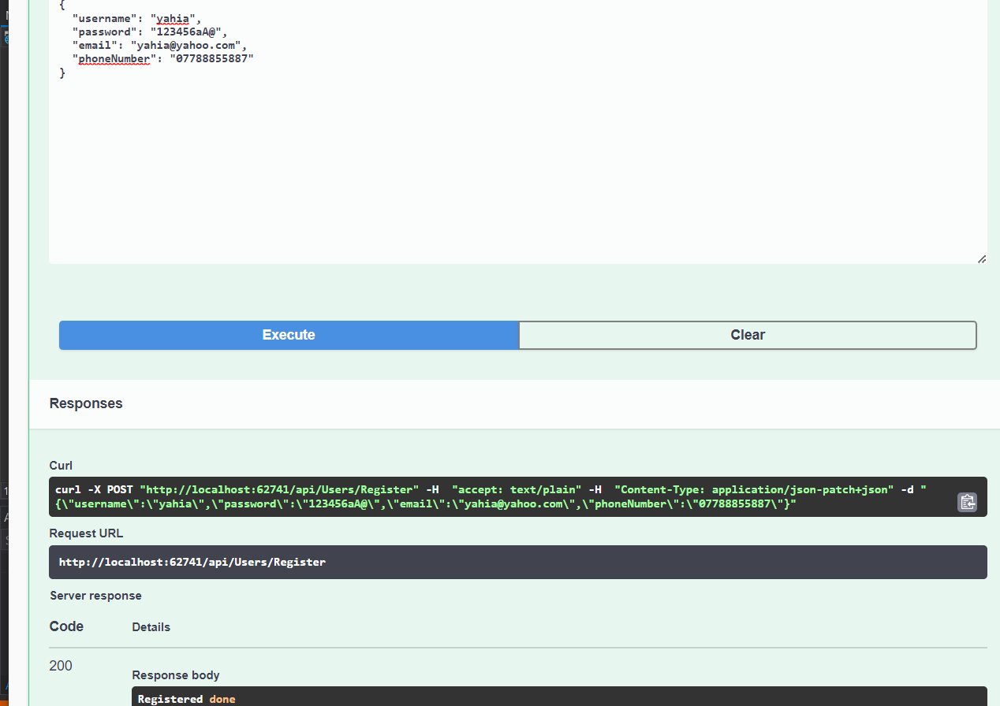
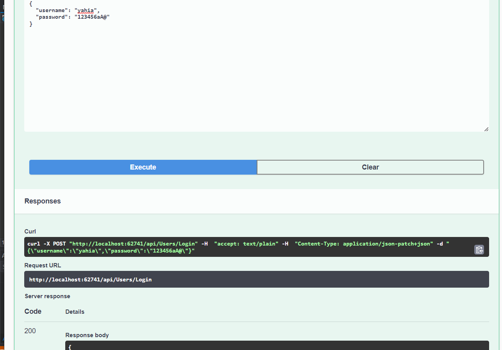

# -Async-Inn

## introduction 

This is a ASP.NET Core MVC web application that will allow Async Hotel to
Show the data and manage thier Hotels.

---

- Hotel table has one to many relationship with HotelRoom table.

- Room table has one to many relationship with HotelRoom table.

- Amenities table has one to many relationship with RoomAmenities table.

- HotelRoom table is a joint table with payload.

- RoomAmenities table is pure join table.

---

 what the architecture pattern is and how it is used in the app?

 1- we use Interface and repo to build our service.
 2- then we add our logic in controller. 

 ---

 In this lab we add rougt to our app and we made a server for join table.

 ---

 in lab 16 we add DTOs for our app and you can use it by clone a repo then run a program and do run then take a rought put it in the url search then you will see the results.

 ---

 lab 18 we use Identity  
 
 

 ---

 lab 19 we use role
 1. District Manager
District manager can do full CRUD operations on all Hotel, HotelRoom, Room, and Amenity entities.
2. The district manager can create accounts for all other roles
Property Manager
Property Manager’s can add/update/read new HotelRooms to hotels, and amenities to rooms. A property manager cannot create new room entities or hotel entities.
The property manager can only create accounts for Agents
3. Agent
An agent can only update/read a HotelRoom and add/delete amenities to rooms
4. Anonymous users
anonymous users can only view all GET routes