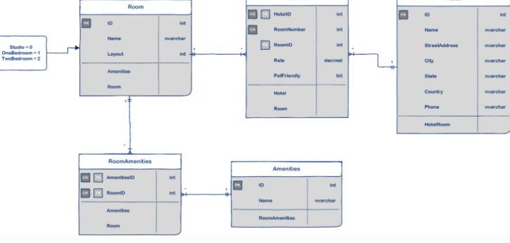

# -Async-Inn

## introduction 

This is a ASP.NET Core MVC web application that will allow Async Hotel to
Show the data and manage thier Hotels.

---

- Hotel table has one to many relationship with HotelRoom table.

- Room table has one to many relationship with HotelRoom table.

- Amenities table has one to many relationship with RoomAmenities table.

- HotelRoom table is a joint table with payload.

- RoomAmenities table is pure join table.

---

 what the architecture pattern is and how it is used in the app?

 1- we use Interface and repo to build our service.
 2- then we add our logic in controller. 

 ---

 In this lab we add rougt to our app and we made a server for join table.

 ---

 in lab 16 we add DTOs for our app and you can use it by clone a repo then run a program and do run then take a rought put it in the url search then you will see the results. 